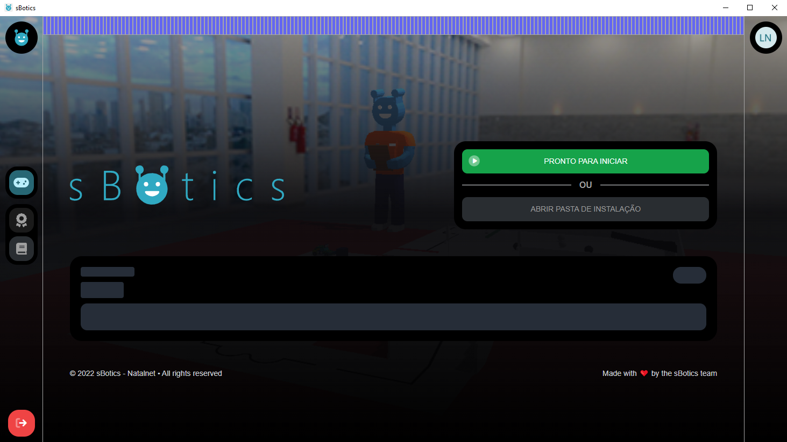

<br>
<p align="center">
	
    <br>
    <sup>An acessible Robotics Kit, from the comfort of your chair.</sup>
</p>
<hr>

<br>

<h2 align="center">
	The official sBotics Launcher source code
</h2>
<p align="center">
    <b>For non-commercial (educational) purposes <i>only</i></b>.
	<br>
    <b><i>Apenas</i> para usos não-comerciais (educacionais)</b>.
    <br><br>
    <sub>
        <a href="#portuguese"> Português</a> 
        &nbsp;•&nbsp;
        <a href="#english"> English</a>
    </sub>
	<br>
	<strong>
		<a href="https://sbotics.net">Website</a>
		•
		<a href="https://docs.sbotics.net">Documentation</a>
	</strong>
</p>

<br>

<p align="center">
	
</p>

<br>

--------------
<h2 id="english">  &nbsp;English </h2> 

### Compiling instructions
Download dependencies: 
```bash
yarn install
```

Run application:
```bash
yarn start
```

--------------
<h2 id="portuguese">  &nbsp;Português (Brasileiro) </h2> 

### Instruções de compilação
Baixando dependências: 
```bash
yarn install
```

Rodar a aplicação:
```bash
yarn start
```

--------------
## Credits
These credits are not valid for the entire *sBotics Organization*, but were made **specifically** for this repository. While other contributors may appear in the future through github's Pull Request feature, their credit shall remain only on github's contributor section, keeping these credits below intact to be changed only by actual sBotics simulator developers.

* [Júlio Neto](http://www.linkedin.com/in/julio-c-neto) - Designed and implemented the current sBotics launcher;
* [Thiago Nascimento](https://www.linkedin.com/in/txiag) - Implemented the first iterations/versions of this tool;
* [Lucas Nascimento](https://www.linkedin.com/in/lucas-moura-do-nascimento) - Designed (CSSs files) the first versions of the launcher. 

--------------

## License and terms
 As sBotics itself is a closed-source software, this repository may serve *only* for educational purposes. You can still fork and create pull-requests on documentation and to improve functionalities, however, all recreations must also be open source and for educational purposes, **never** for personal gains or profit.

 Visto que o sBotics em si é um software de código fechado, este repositório deve servir *apenas* para propósitos educacionais. Você pode criar forks e pull-requests relacionados a melhorias de documentação e funcionalidades, entretanto toda e qualquer recriação deve também ser de código aberto e **jamais** para ganhos pessoais ou lucro.